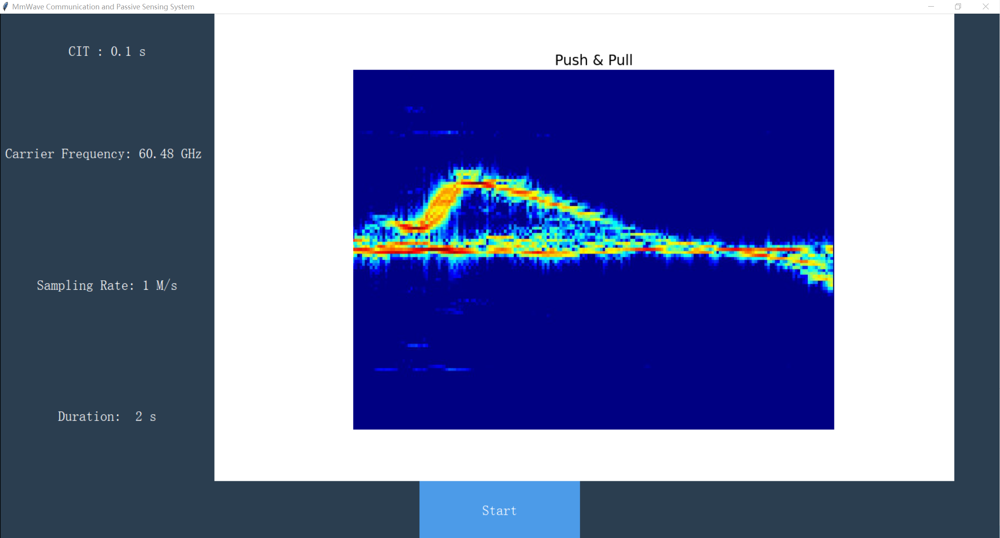
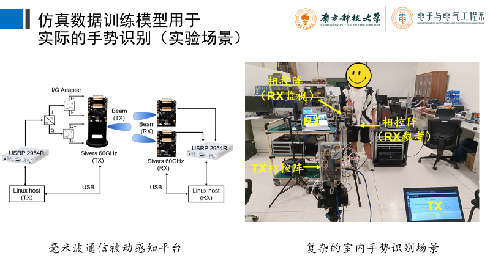

# RxRealTime_GUI_rzy

| GUI Image                                                    | Experiment Image                                             |
| ------------------------------------------------------------ | ------------------------------------------------------------ |
|  |  |

## Overview

This project implements real-time gesture recognition based on millimeter-wave passive sensing and communication systems. The model is trained using a simulated dataset. The images used for testing are processed with MATLAB to calculate spectrograms, ensuring they are in the same domain as the trained images, which are plotted using MATLAB.

## Main Dependencies

- [PyTorch](https://pytorch.org/), Matplotlib, NumPy, and other basic machine learning utilities.
  
  - Install dependencies using: 
    ```bash
    pip3 install -r requirements.txt
    ```
  
- [Matlab Engine API for Python](https://www.mathworks.com/help/matlab/matlab_external/get-started-with-matlab-engine-for-python.html) (Requires Python 3.8+ and MATLAB).
  
- [UHD](https://github.com/EttusResearch/uhd) (USRP driver, requires Python 2.7).

## Acknowledgement

This functionality is derived from the source codes provided by [Chao Yu](https://github.com/Ychao12032212).
